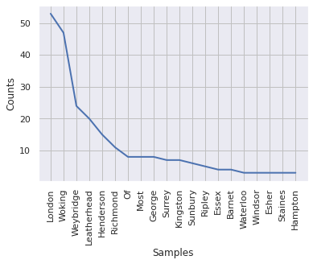
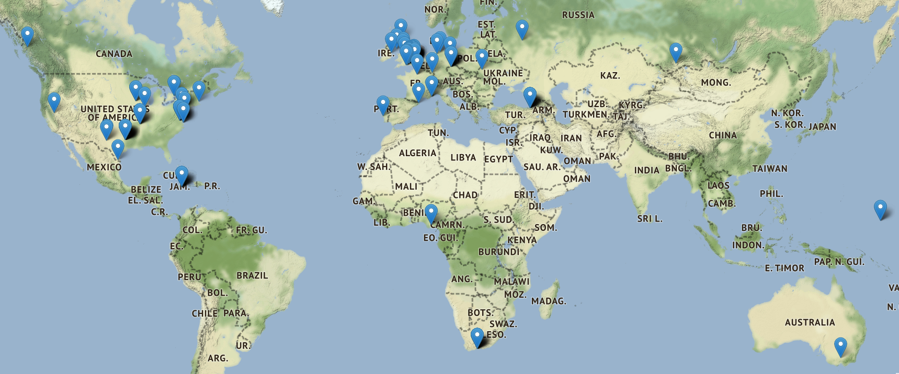

# Geoparsing with Python: Lab 6, Max Enger

### The code generated for this repository was created in Google Colab and focuses on geoparsing. Geoparsing is the process of extracting place-names from text aadn matching the names captured to that of spatial locations using coordinates. The script uses openly available books from the [Gutenberg Project](https://www.gutenberg.org/about/) to develop a geoparsed map that details the locations used in the book. It first takes a text file of the book and takes the cities and adds the appropriate latitude and longitude before adding them to a folium world countries shapefile. The War of the Worlds by H.G Wells was used in this script. This book details the experiences about Aliens returning to Earth to cause havoc. The challenges in creating such a script is ensuring that there are enough locations to observe, it is also helpful to use books that are more worldly, for example, the alien invvasion is the War of the Worlds is a gloabl phenomenon. Having a book centered around local events will limit the distribuition of the final product. 

The Cities Identified in the Book are plotted like this:

The final Folium Map looks something like this:

### Coding Challenge Questions
- Is the gazetteer we're using appropriate for the text? What might be some of the challenges of using Nominatim with a book published in 1859?
The nomination used in a book published in 1859 can be much differnt than what is used today. This is especially the case with locations, for example, Mark Twain had a residence in Connecticut, which has undergone many spatial name changes in the past 200 years. The city where I live, Glastonbury, has changed from Glastenbury.  

- How accurate do you think the outputs are? Are there any city names that seem suspect? If so, what are some Natural Language Processing methods that you could use to filter words that might be city names, but probably weren't intended as city references in the text?

- What are some alternative approaches to mapping the data? The tutorial here uses duplicate entries and opacity to present a type of "color ramp": could this be done better?
A Chloropleth map could be a useful aternative to show distribution by country. A cartogram could also be an interesting visualization to distort our map based on how many times it is referenced, this would be based on the amount of times the specfic country is called in the book. 
